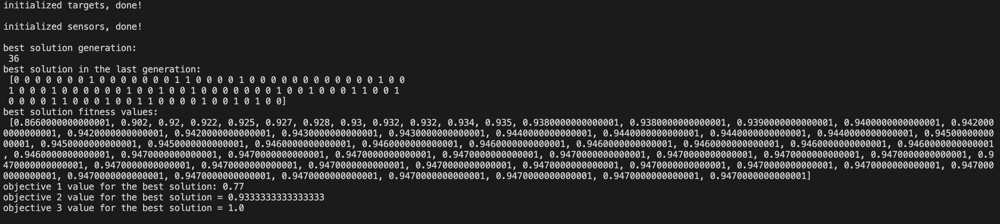
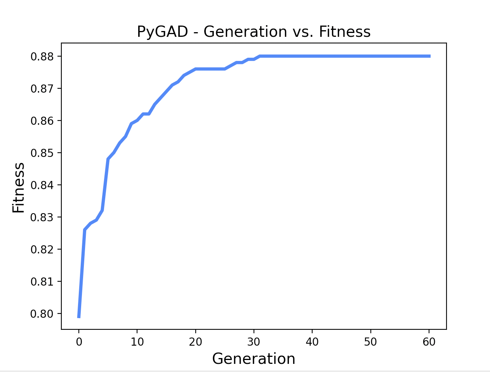

K-Coverage, M-Connected node placement in WSN problem using Genetic Algorithm
==================

Description
===============

- This project uses PyGAD python pakage to build GA pipeline.
- Implemented based on the article [here](https://www.sciencedirect.com/science/article/abs/pii/S0045790615003651?via%3Dihub)
- the GA uses: single point crossover, steady-state selection for selecting parents.
- randomly generate targets, sensors' potential positions (implement in ./initialization.py)

Instruction
===============

- Install PyGAD: `pip install pygad`
- The main file is ./main.py, run it to get insights on the population and the best solution found.

Results
===============

`python main.py`

